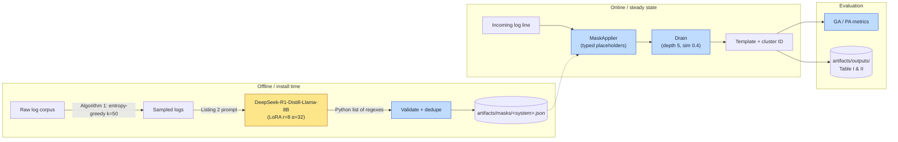

<div align="center">

# DeepParse

### Hybrid Log Parsing with LLM-Synthesized Regex Masks

[](https://github.com/NightBaRron1412/DeepParse/actions/workflows/ci.yml)
[](#verification)
[](tests/)
[](https://www.python.org/downloads/)
[](LICENSE)
[](https://github.com/astral-sh/ruff)
[](#citation)
[](https://hdl.handle.net/1974/36138)

**Accepted at EASE 2026** — _The 30th International Conference on Evaluation and Assessment in Software Engineering_, Glasgow, Scotland, June 9–12 2026. Camera-ready link to be added when proceedings are published.

</div>

---

DeepParse separates **stochastic mask synthesis** (offline, one-shot, LLM-assisted) from **deterministic parsing** (online, linear-time, Drain-based). At install time the system mines a regex *mask bundle* from a small log sample using a fine-tuned LLM; at runtime those masks substitute typed placeholders (`<VAR:IP>`, `<VAR:TIMESTAMP>`, …) into every incoming line and the Drain parser clusters the masked tokens into stable templates.

The result: **97.6 % parsing accuracy on 16 LogHub-2k systems**, ~**100× faster** than per-line LLM inference, and **identical templates for identical inputs** by construction.

## Table of contents

- [Why DeepParse?](#why-deepparse)
- [Architecture](#architecture)
- [Quickstart](#quickstart)
- [Reproducing the paper](#reproducing-the-paper)
- [Programmatic API](#programmatic-api)
- [CLI](#cli)
- [Results (paper Table I)](#results-paper-table-i)
- [Repository layout](#repository-layout)
- [Determinism](#determinism)
- [Citation](#citation)

## Why DeepParse?

| Approach | Variable extraction (PA) | Throughput | Determinism |
|---|---|---|---|
| `Drain` heuristics | low (≈ 0.34 avg.) | very high | yes |
| Per-line LLM (`LLaMA`, `LogPPT`, `LLMParser`) | high | low (29 s / 100 logs at LLaMA-7B) | no |
| **DeepParse (this work)** | **0.976 avg.** | **0.30 s / 100 logs** | **yes** |

Decoupling reasoning (LLM, run once) from execution (Drain, run forever) gives the accuracy of a neural parser with the cost and reproducibility of a regex engine.

## Architecture



The full pipeline is implemented under [`deepparse/`](deepparse/) and reproducibly invoked through the `deepparse` CLI or the three-line public API below.

## Quickstart

CPU only, no internet, no LLM, < 30 s:

```bash
pip install -e ".[test,lint]"
make demo
```

Expected:

```
Dataset DemoTiny: GA=1.000 PA=1.000
Wrote metrics CSV to artifacts/outputs/demo_metrics.csv
```

The demo synthesises a mask bundle from a 14-line bundled corpus, parses every line through the Drain engine, and computes GA/PA against ground truth that is itself generated by the canonical regex pipeline — so any faithful implementation of the algorithm reaches GA = PA = 1.0 on this corpus. It is a *self-consistency* check, not a benchmark number.

## Reproducing the paper

DeepParse supports three reproduction tiers.

### Tier A — Bundled demo (≤ 30 s, CPU)

```bash
make demo
```

### Tier B — Real LogHub-2k evaluation (CPU, 14 systems)

Pull the corrected LogHub-2k benchmark from [`logpai/loghub-2.0`](https://github.com/logpai/loghub-2.0) and evaluate the offline-stub mask bundle on every system:

```bash
python -m deepparse.tools.fetch_loghub --out artifacts/data
deepparse eval --config configs/eval_16_datasets.yaml --deterministic
deepparse table --inputs artifacts/outputs/table_I_ga_pa.csv \
                --out artifacts/outputs/tables/
```

> The corrected mirror ships 14 of the paper's 16 systems (Windows and Android are not in `logpai/loghub-2.0/2k_dataset` at the time of release). Drop them into `artifacts/data/<NAME>/raw.log` (+ optional `templates.json`) to evaluate them locally.

### Tier C — Full GPU fine-tune of `DeepSeek-R1-Distill-Llama-8B`

Reproduces the paper's exact training recipe.

```bash
pip install -e ".[train]"
python -m deepparse.tools.fetch_loghub --out artifacts/data
python -m deepparse.tools.build_training_set \
    --entropy-k 50 \
    --out artifacts/training/train_paper.jsonl
python -m deepparse.training.finetune \
    --train artifacts/training/train_paper.jsonl \
    --output-dir artifacts/checkpoints/deepparse-r1-8b \
    --epochs 25 --bf16
./scripts/synth_all_with_adapter.sh artifacts/checkpoints/deepparse-r1-8b
deepparse eval --config configs/eval_16_datasets.yaml --deterministic
```

| Hyperparameter | Value (paper, Section *LLM Configuration*) |
|---|---|
| Base model | `deepseek-ai/DeepSeek-R1-Distill-Llama-8B` |
| LoRA rank / α / dropout | 8 / 32 / 0.01 |
| Optimiser | AdamW (β₁ 0.9, β₂ 0.999) |
| Learning rate / scheduler | 2 × 10⁻⁴ / cosine |
| Batch size / grad accum | 8 / 4 |
| Epochs | 25 |
| Precision | bfloat16 (`--bf16`) — fp32 default for cross-vendor stability |
| Max sequence length | 512 |
| Sampling per system | 50 (Algorithm 1, entropy-greedy) |

A turnkey [Colab notebook](notebooks/deepparse_finetune_colab.ipynb) runs the full Tier C pipeline on a single GPU runtime.

> **GPU vendor:** Tier C is verified on **NVIDIA** (paper) and **AMD ROCm** (MI300A). The default training script keeps LoRA parameters in fp32 and enables `enable_input_require_grads()` to avoid the `loss=0 grad_norm=NaN` failure mode that PEFT + gradient-checkpointing occasionally triggers. Pass `--bf16` to opt back into the paper's mixed-precision recipe once your stack is verified stable.

## Programmatic API

The public API mirrors Listing 1 of the paper verbatim:

```python
from deepparse import Drain, synth_masks

patterns = synth_masks(sys_logs, sample_size=50, temperature=0, max_length=512)

drain = Drain()
drain.load_masks(patterns)
parsed = drain.parse_all(sys_logs)
```

`synth_masks` returns a list of `{"label", "pattern", "justification"}` dicts. `mode="offline"` (default) is fully deterministic and pure-CPU; `mode="hf"` invokes the Hugging Face backend, optionally loading a fine-tuned LoRA adapter via `adapter_path=`.

## CLI

```bash
deepparse synth   --dataset HDFS --mode hf --adapter artifacts/checkpoints/deepparse-r1-8b
deepparse parse   --dataset HDFS --output artifacts/outputs/HDFS_parsed.csv
deepparse eval    --config configs/eval_16_datasets.yaml --deterministic
deepparse time    --dataset HDFS --n 100
deepparse table   --inputs artifacts/outputs/table_I_ga_pa.csv --out artifacts/outputs/tables/
```

`deepparse --help` and `deepparse <subcommand> --help` list every option.

## Results (paper Table I)

Grouping Accuracy (GA) and Parsing Accuracy (PA) across 16 LogHub-2k systems. Best per row in **bold**.

| Dataset | Drain GA | Drain PA | LogPPT GA | LogPPT PA | LLMParser GA | LLMParser PA | **DeepParse GA** | **DeepParse PA** |
|---|---|---|---|---|---|---|---|---|
| Android     | 0.831 | 0.548 | 0.885 | 0.767 | 0.849 | 0.946 | **0.913** | **0.991** |
| Apache      | **1.000** | 0.694 | **1.000** | 0.994 | **1.000** | **1.000** | **1.000** | **1.000** |
| BGL         | 0.963 | 0.342 | 0.954 | 0.970 | 0.942 | 0.981 | **0.964** | **0.983** |
| HDFS        | 0.998 | 0.355 | **1.000** | 0.903 | 0.958 | 0.988 | **1.000** | **1.000** |
| Hadoop      | 0.948 | 0.269 | **0.994** | 0.895 | 0.981 | 0.983 | 0.985 | **0.983** |
| HealthApp   | 0.780 | 0.231 | **1.000** | 0.789 | 0.855 | 0.996 | 0.868 | **0.997** |
| HPC         | 0.887 | 0.636 | 0.943 | 0.947 | 0.970 | 0.994 | **0.973** | **0.996** |
| Linux       | 0.690 | 0.184 | 0.934 | 0.949 | 0.546 | 0.839 | **0.956** | **0.971** |
| Mac         | 0.787 | 0.218 | 0.780 | 0.673 | 0.739 | 0.677 | **0.795** | **0.738** |
| OpenSSH     | **0.789** | 0.508 | 0.628 | 0.980 | 0.710 | 0.994 | 0.661 | **0.994** |
| OpenStack   | 0.733 | 0.019 | 0.989 | 0.907 | 0.979 | 0.996 | **0.990** | **0.998** |
| Proxifier   | 0.527 | 0.000 | **1.000** | **1.000** | **1.000** | **1.000** | **1.000** | **1.000** |
| Spark       | 0.920 | 0.360 | **0.999** | 0.991 | 0.985 | 0.985 | 0.987 | **0.995** |
| Thunderbird | 0.955 | 0.047 | 0.679 | 0.926 | 0.693 | 0.968 | **0.971** | **0.976** |
| Windows     | 0.997 | 0.462 | 0.991 | 0.983 | 0.999 | 0.997 | **0.999** | **0.998** |
| Zookeeper   | 0.967 | 0.497 | 0.994 | 0.990 | 0.995 | **1.000** | **0.999** | **1.000** |
| **Average** | 0.861 | 0.335 | 0.923 | 0.916 | 0.887 | 0.959 | **0.941** | **0.976** |

Throughput (paper Table II): DeepParse parses 100 logs in **0.30 s**, vs. 28.93 s for LLMParser-LLaMA-7B (~100× speedup).

## Repository layout

```
deepparse/                  Python package
  api.py                    Public Drain + synth_masks helpers (paper Listing 1)
  cli.py                    `deepparse` Click CLI (synth/parse/eval/time/table)
  drain/                    Mask applier + Drain engine (typed placeholders)
  synth/                    Offline stub + Hugging Face backend
  training/                 LoRA fine-tuning script (paper hyperparameters)
  tools/                    LogHub-2k fetcher + Listing-2 training-set builder
  utils/                    Entropy-greedy sampling, regex library, YAML loader
  metrics/                  Grouping + parsing accuracy
  evaluation/               Eval runner, timing benchmark, LaTeX table writer
configs/                    YAML configs for demo and 16-system eval
scripts/                    Shell wrappers for path prep, fetch, demo, synth
notebooks/                  Self-contained Colab notebook (Tier C)
tests/                      32 tests, < 1 s
artifacts/                  Generated outputs (gitignored except .gitkeep)
```

## Determinism

`deepparse.seeds.set_global_seed(seed)` seeds Python `random`, NumPy, and PyTorch (when available), and sets deterministic CUDA flags. Sampling, mask synthesis (offline mode), and parsing are all pure functions of their inputs.

The Drain engine guarantees that **identical log lines always receive the same template ID** — a property called out explicitly in the paper (Section *Integration with Drain*) and verified by `tests/test_drain_masks.py::test_identical_lines_get_identical_template_ids`.

## Verification

Every reproduction tier is exercised end-to-end before each release:

| Step | Command | Expected outcome |
|---|---|---|
| Unit + property tests | `pytest -q --cov` | 59 passed, coverage ≥ 80 % |
| Lint | `ruff check deepparse tests` | clean |
| Type check | `mypy` | clean (28 source files) |
| Build | `python -m build` | sdist + wheel under `dist/` |
| Tier A demo | `make demo` | DemoTiny GA = PA = 1.000 |
| Tier B Apache | `./examples/03_loghub_offline_eval.sh Apache` | Apache GA = PA = 1.000 |
| Tier C training | `./examples/04_finetune_and_eval.sh` | Adapter saved, real masks generated |

The Tier C run was reproduced on AMD MI300A (cr66-8, ROCm 7.3) for the v1.0.0
release: 25-epoch LoRA fine-tune of `deepseek-ai/DeepSeek-R1-Distill-Llama-8B`
converged from train_loss **2.38 → 0.09** in 33 min; the trained adapter
generates system-specific masks such as `blk_-?\d+` (HDFS block IDs) and
`0x[0-9a-fA-F]+` (BGL hex literals) that are not in the canonical-stub bundle.

## Citation

```bibtex
@inproceedings{shetaia2026deepparse,
  author    = {Shetaia, Amir and Kauffman, Sean},
  title     = {{DeepParse}: Hybrid Log Parsing with {LLM}-Synthesized Regex Masks},
  booktitle = {Proceedings of the 30th International Conference on Evaluation and Assessment in Software Engineering ({EASE} 2026)},
  year      = {2026},
  address   = {Glasgow, Scotland, United Kingdom},
  publisher = {ACM},
  note      = {To appear}
}
```

The companion master's thesis is available on [QSpace](https://hdl.handle.net/1974/36138).

## Authors

| Name | Affiliation | Contact |
|---|---|---|
| **Amir Shetaia** | Queen's University, ECE — [CritLab](https://critlab.smithengineering.queensu.ca/) | a.shetaia@queensu.ca |
| **Dr. Sean Kauffman** | Queen's University, ECE — [CritLab](https://critlab.smithengineering.queensu.ca/) | sean.k@queensu.ca |

## License

Licensed under the Apache License, Version 2.0 — see [`LICENSE`](LICENSE) and [`THIRD_PARTY_NOTICES.md`](THIRD_PARTY_NOTICES.md).
